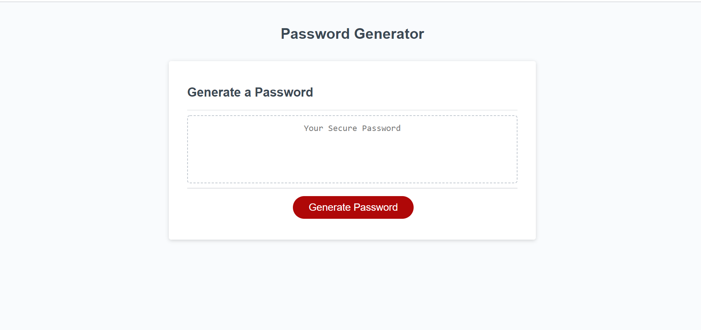

# Passowrd Generator

This is a password generator I made using JavaScript. This has easily been one of the more difficult things I have done so far, but overall it was a great learning experience. Using a mixture of arrays, variables, loops, and true/false statements I was able to create something to be proud of. 

## Table of Contents
* [Include JavaScript Link in the HTML](Include-JavaScript-Link-in-the-HTML)
* [Create the Functional Password Generator](Create-the-Functional-Password-Generator)
* [Credit](Credit)
* [License](License)

## Include JavaScript Link in the HTML

1. Put JavaScript file into the Develop folder.
2. Update the script tag in the HTML file.

## Create the Functional Password Generator

1. Use JavaScript to create a working password generator
2. The password will start to generate once the Generate Password button is clicked.
3. Users will be prompted with a various alerts to confirm if they would like lower case letters, upper case letters, special characters, and/or numbers.
4. Once the user has made those selections a unique password with their cirteria will be genertated.  

(https://wchenausky.github.io/password_generator/.)  

(https://github.com/wchenausky/password_generator)

## Credit

* Marisa NeSmith 
(https://github.com/marisanesmith)

* Ethan Dutcher
(https://github.com/edutcher)

## License

